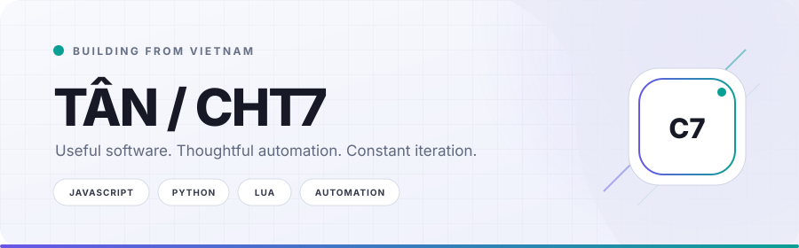
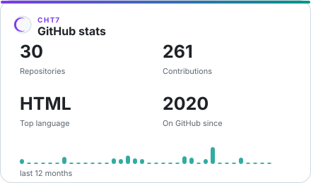

<div align="center">
  <picture>
    <source media="(prefers-color-scheme: dark)" srcset="./assets/hero-dark.svg">
    <source media="(prefers-color-scheme: light)" srcset="./assets/hero-light.svg">
    
  </picture>
</div>

<p align="center">
  <a href="https://github.com/CHT7"></a>
  <a href="https://bio.link/moondiscord"></a>
  
</p>

## Hello / Xin chào

I'm Tân, an independent developer who enjoys turning repetitive work and curious ideas into practical software. I learn by building, breaking, and shipping — usually somewhere between automation, backend tools, and small products that solve a real problem.

```text
currently  →  sharpening my systems, automation, and product-building skills
principle  →  useful first, polished always, simpler when possible
```

## Selected work

| Project | What it solves | Stack |
| :-- | :-- | :-- |
| [cash-counter](https://github.com/CHT7/cash-counter) | Counts cash and handles transactions that happen during reconciliation. | JavaScript |
| [DiabloNetwork](https://github.com/CHT7/DiabloNetwork) | Discovers devices on a local network and enriches MAC vendor information. | Python |
| [Roblox_Scripts](https://github.com/CHT7/Roblox_Scripts) | A public collection of scripts created or adapted for testing and automation. | Lua |

## GitHub at a glance

<div align="center">
  <picture>
    <source media="(prefers-color-scheme: dark)" srcset="./assets/profile-stats-dark.svg">
    <source media="(prefers-color-scheme: light)" srcset="./assets/profile-stats-light.svg">
    
  </picture>
</div>

<sub>Private repositories are included only as aggregate numbers. Their names, descriptions, languages, URLs, and activity details are never published by this repository.</sub>

## Toolbox

<p>
  
  
  
  
  
  
</p>

## Find me

The easiest way to reach me is through [my social hub](https://bio.link/moondiscord). More links live at [guns.lol/ddiablo](https://guns.lol/ddiablo).

<details>
  <summary>Support my work</summary>
  <br>
  If something I made helped you, you can support future experiments through
  <a href="https://www.buymeacoffee.com/HoangTan">Buy Me a Coffee</a>,
  <a href="https://www.paypal.com/paypalme/chtan7">PayPal</a>, or
  <a href="https://playerduo.net/hoangtan85">PlayerDuo</a>.
</details>

<br>

<p align="center"><sub>Designed and automated by CHT7 · Metrics refresh only when the underlying numbers change.</sub></p>
