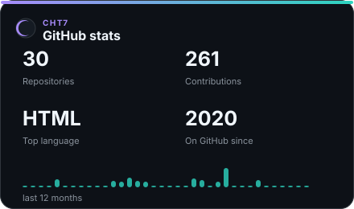
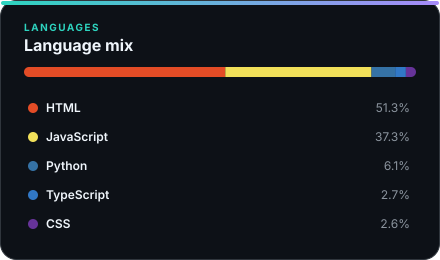

  

  

  

    
    
    
  

  

## Xin chào 👋

Mình là **Tân**. Thỉnh thoảng code bot Discord, làm web, viết vài công cụ linh tinh, chủ yếu là vì tự dưng nghĩ ra thứ gì đó rồi muốn xem mình có làm được không <3 .

Phần lớn mấy thứ mình làm đều bắt đầu khá đơn giản, sau đó sửa tới sửa lui rồi thành một thứ khác hẳn ban đầu.

Ngoài GitHub thì mình thường ở **Moon**, Server Discord mình vẫn đang chăm chút mỗi ngày.

## MoonBot & Moon 🌙

<table>
  <tr>
    <td width="120" align="center">
      
    </td>
    <td>
      <strong>MoonBot</strong> 
      Bot Discord đa năng dành cho cộng đồng, có tiện ích server, giải trí, economy, mini-game và các hệ thống tương tác.  
      
      
      
    </td>
  </tr>
</table>

  
   
  
  

## GitHub của mình 📊

  <picture>
    <source media="(prefers-color-scheme: dark)" srcset="./assets/profile-stats-dark.svg">
    <source media="(prefers-color-scheme: light)" srcset="./assets/profile-stats-light.svg">
    
  </picture>
  <picture>
    <source media="(prefers-color-scheme: dark)" srcset="./assets/languages-dark.svg">
    <source media="(prefers-color-scheme: light)" srcset="./assets/languages-light.svg">
    
  </picture>

## Mấy thứ mình hay dùng 🧰

  

## Châm ngôn ✍️

  

## Ghé chơi nhé ☕

  
  
  

  
Nếu bạn muốn ủng hộ thêm

   
  Ngoài Buy Me a Coffee, mình còn có <a href="https://www.paypal.com/paypalme/chtan7">PayPal</a> và <a href="https://playerduo.net/hoangtan85">PlayerDuo</a>. Cảm ơn bạn đã ghé qua!

